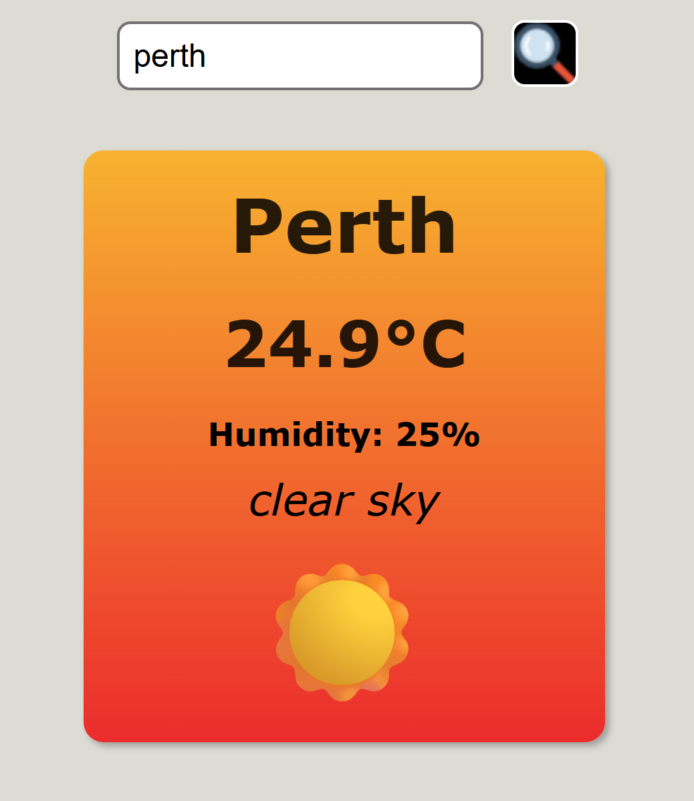

# 🌤️ Weather App

A simple weather app that lets users search any city and view real-time weather data — temperature, humidity, and sky conditions — in a clean, responsive design.

---

## 🚀 Features

* Search weather by city
* Shows temperature (°C), humidity, and condition
* Uses OpenWeatherMap API
* Simple, modern UI
* Fully responsive

---

## 🛠️ Tech Stack

- **HTML** 
- **CSS**
- **JavaScript**
- **OpenWeatherMap API**

---

## ⚙️ How to Use

1. Enter a city name and click the search icon.
2. The app displays current temperature, humidity, and sky status.
---

## 📸 Preview

---

**Made by Shaunik Virdi**
